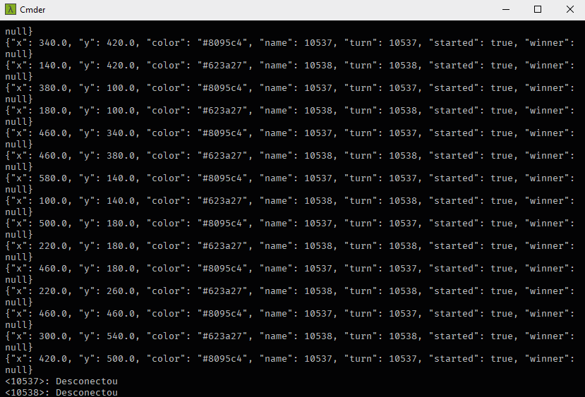

# Gomoku Game Back-End

Serves the application [Gomoku Game Front-End](https://github.com/douglasJovenil/gomoku-game-frontend). This server is responsible for manage the communication between the players using Sockets.

## ☁️ Links

- [Front-End code](https://github.com/douglasJovenil/gomoku-game-frontend)

## 💻 Project

### Server Running



## 🚀 Technologies

This project was developed with the following technologies:

 Python3.7+

 Sockets

## 🏃 Usage

```bash
git clone https://github.com/douglasJovenil/gomoku-game-backend
cd gomoku-game-backend/src
python main.py
```
